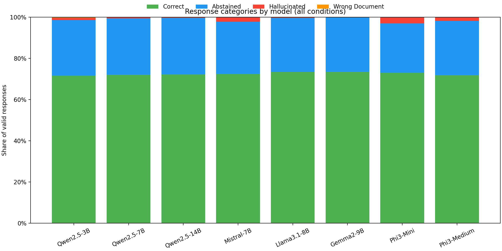
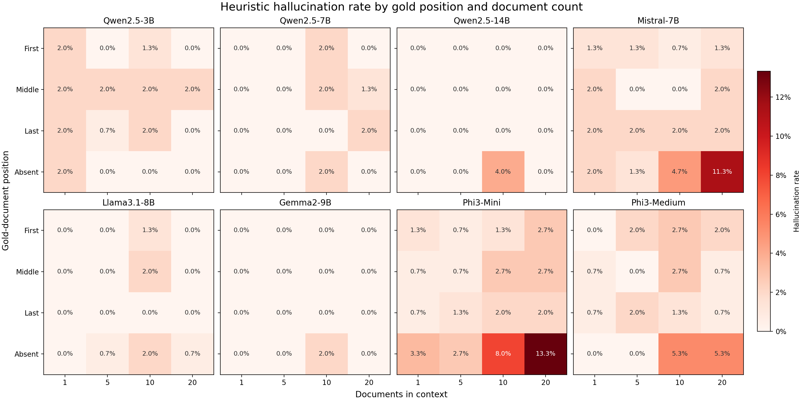

# Lost in Context: Answer Position and Hallucination in Open LLMs

An empirical study of how the number of retrieved documents and the location of a relevant document affect answer behavior in instruction-tuned language models. The experiment separates responses into correct answers, abstentions, distractor-based answers, and unsupported answers.

## Why this matters

Retrieval-augmented generation systems can provide the right evidence without guaranteeing that a model will use it. This project tests two simple failure modes: adding irrelevant context and moving the answer-bearing document from the beginning to the middle or end of the prompt. An answer-absent control measures whether each model follows the instruction to say “I don't know.”

## Experimental design

- **Dataset:** 50 questions sampled with seed 42 from the `nq_open` validation split.
- **Contexts:** 1, 5, 10, or 20 documents, with the gold document first, middle, last, or absent.
- **Scale:** 50 questions × 4 document counts × 4 positions = 800 scenarios per trial.
- **Trials:** three sampled decoding trials per model (temperature 0.7, up to 100 new tokens).
- **Prompt:** answer only from the supplied documents and abstain when the answer is missing.
- **Models:** Qwen2.5 (3B, 7B, 14B), Mistral-7B, Llama-3.1-8B, Gemma-2-9B, Phi-3 Mini, and Phi-3 Medium.
- **Precision:** Qwen2.5-14B and Phi-3 Medium use 4-bit NF4 quantization; the other models use bfloat16. This is an important comparison caveat.

The NQ Open configuration does not provide source passages here. Consequently, this project constructs a gold sentence that directly states the answer and uses other NQ question-answer strings as distractors. “Context length” therefore means **document count**, not token count or natural passage length.

### Response labels

`src/classify_response.py` applies transparent lexical rules in this order:

1. **Abstained:** contains a configured abstention phrase.
2. **Correct:** contains the normalized gold answer or at least half of its answer tokens.
3. **Wrong document:** has Jaccard token overlap of at least 0.3 with a distractor.
4. **Hallucinated:** matches none of the rules above.

These labels support consistent comparison, but “hallucinated” is a residual heuristic label—not a human-verified factuality judgment.

## Results

The curated summaries contain 19,199 valid responses from eight models and three trial directories. One of 19,200 original files was empty (`Qwen2.5-14B`, trial 2, scenario 631); it is excluded and disclosed in [`results/summary/provenance.json`](results/summary/provenance.json).



Overall correct rates were tightly grouped from **71.75% to 73.50%**. This is not a general QA accuracy result: 75% of the experimental conditions contain an explicit answer sentence, so the aggregate mainly serves as a cross-model behavior summary.



The clearest observed failure mode was the long, answer-absent condition. With 20 distractors, the heuristic hallucination rate reached **13.33% for Phi-3 Mini**, **11.33% for Mistral-7B**, and **5.33% for Phi-3 Medium**. Wrong-document matches were rare under the current overlap rule (at most **0.29% overall**). These are descriptive results; this project does not claim statistical significance.

Machine-readable evidence:

- [`overall_response_rates.csv`](results/summary/overall_response_rates.csv) — counts and pooled rates by model.
- [`response_rates_by_condition.csv`](results/summary/response_rates_by_condition.csv) — counts and rates by model, document count, and gold position.
- [`provenance.json`](results/summary/provenance.json) — source counts, invalid-record disclosure, and aggregation notes.

## Repository structure

```text
.
├── README.md
├── requirements.txt
├── run.sh
├── src/
│   ├── build_contexts.py       # construct the 800 evaluation scenarios
│   ├── run_experiment.py       # run one model/trial with resumable outputs
│   ├── classify_response.py    # apply the four response labels
│   └── analyze_results.py      # aggregate raw runs and regenerate figures
├── tests/
│   ├── test_classify_response.py
│   └── test_run_experiment.py
├── results/
│   └── summary/                # small, curated aggregate results
└── figures/                    # representative portfolio plots
```

Downloaded data and per-response runs are intentionally ignored. Curated summaries and figures remain tracked.

## Setup

Python 3.10+ and a CUDA-capable environment are recommended. The largest runs were designed around approximately 22 GiB of GPU memory. Model access is subject to each Hugging Face repository's terms; Llama and Gemma may require accepting their licenses and running `hf auth login`.

```bash
python3 -m venv .venv
source .venv/bin/activate
python -m pip install --upgrade pip
python -m pip install -r requirements.txt
```

## Run the pipeline

The wrapper always changes to the repository root, so commands work from any directory.

```bash
# 1. Download NQ Open and build contexts
./run.sh build

# 2. Smoke-test one model on five scenarios
./run.sh run --model qwen2.5:3b --trial 1 --limit 5

# 3. Label one model's completed trials
./run.sh classify --model qwen2.5:3b --show-samples

# 4. Aggregate every available model and regenerate figures
./run.sh analyze
```

For a full reproduction, run trials 1–3 for each key shown by `python src/run_experiment.py --help`, then classify each model and analyze all runs. Raw files are written under `results/runs/` and are not committed. Future runs save a configuration manifest, scenario hash, model identifier, and deterministic per-scenario seed so interrupted trials resume consistently.

The checked-in summaries document the original run, but exact bit-for-bit reproduction is not possible: the original files did not record package versions, Hugging Face model revisions, or random seeds. The current runner fixes those provenance and seeding gaps for new experiments.

## Validation

Run the lightweight tests without downloading a model:

```bash
python -m unittest discover -s tests -v
python -m compileall -q src tests
```

## Limitations

- Synthetic answer sentences and question-answer distractors are easier and less natural than retrieved passages.
- Document counts do not control token count, and distractor sets are not nested across length conditions.
- At one document, first/middle/last produce identical prompt layouts, so position cannot be distinguished.
- Exact-string filtering may miss answer aliases in distractors, while substring and token-overlap scoring can mislabel responses.
- Abstention phrases take priority even if a response later supplies an answer.
- Quantized and bfloat16 models are not a perfectly controlled precision comparison.
- There is no manual annotation, confidence interval, or statistical significance test.

## Skills demonstrated

Experimental design, Hugging Face model inference, quantized LLM evaluation, reproducible CLI pipelines, heuristic error analysis, data aggregation, visualization, and careful documentation of methodological limits.
